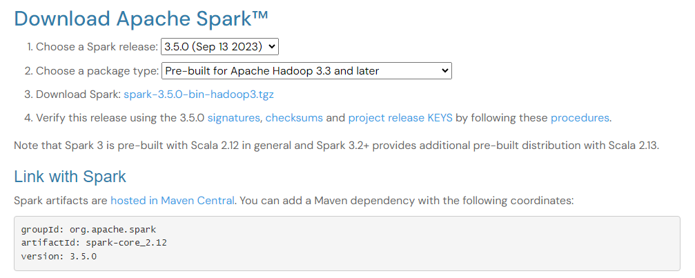
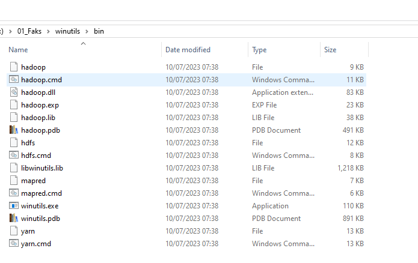
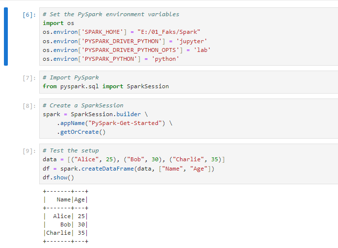
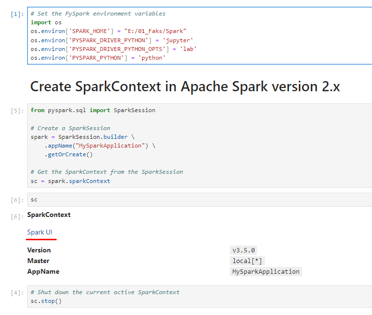

# REQUIREMENTS 
1. JDK i Java
2. Install Apache Spark https://spark.apache.org/downloads.html
 
3. Spremiti file na lako dostupno mjesto i nazvati folder "Spark"
4. Instalirati sljedece Python pakete
   1. pip install pyspark
   2. pip install findspark
   3. pip install jupyterlab
5. Pokrenuti jupyterlab : 
   1. u terminalu napisati : "jupyter-lab"
   2. Ovo bi trebalo pokrenuti jupyter interface u Vašem browseru
   3. Napravite novi Python 3 notebook
6. Hadoop
   1. https://github.com/cdarlint/winutils
   2. Preuzeti repozitorij
      1. folder - hadoop-3.3.5
   3. Spremiti folder na lako dostupno mjesto i nazvati ga "winutils"
   
   4. Dodat "HADOOP_HOME" enviroment varijablu : ( example : E:\01_Faks\winutils )
# Postavljanje okruženja
``` python
# Set the PySpark environment variables
import os
os.environ['SPARK_HOME'] = "E:/01_Faks/Spark" # Stavite Path gdje Vam se nalazi Spark
os.environ['PYSPARK_DRIVER_PYTHON'] = 'jupyter'
os.environ['PYSPARK_DRIVER_PYTHON_OPTS'] = 'lab'
os.environ['PYSPARK_PYTHON'] = 'python'

# Import PySpark
from pyspark.sql import SparkSession

# Create a SparkSession
spark = SparkSession.builder \
    .appName("PySpark-Intro") \ 
    .getOrCreate()

# Test the setup
data = [("Alice", 25), ("Bob", 30), ("Charlie", 35)]
df = spark.createDataFrame(data, ["Name", "Age"])
df.show()
```
Ako dobite sljedeće, uspješno ste postavili PySpark



## SparkContext vs SparkSession

Obratite pozornost na Spark UI

``` python
# Set the PySpark environment variables
import os
os.environ['SPARK_HOME'] = "E:/01_Faks/Spark"
os.environ['PYSPARK_DRIVER_PYTHON'] = 'jupyter'
os.environ['PYSPARK_DRIVER_PYTHON_OPTS'] = 'lab'
os.environ['PYSPARK_PYTHON'] = 'python'

from pyspark.sql import SparkSession

# Create a SparkSession
spark = SparkSession.builder \
    .appName("MySparkApplication") \
    .getOrCreate()

# Get the SparkContext from the SparkSession
sc = spark.sparkContext

sc

# Shut down the current active SparkContext
sc.stop()
``` 



## RDDs ( Resilient Distributed Datasets )
1. Immutable
2. Distributed : particionirani i procesirani u paraleli
3. Resilient
4. Fault-tolerant operacije : map,filter,reduce etc.

### Transformacije
1. Stvaraju nove RDD-ove iz postojećeg tako da se radi neka transformacija na podacima
2. Lazy evaluation
   1. Stvaranje novog RDD se odgađa dok nije apsolutno potrebno izvršiti neku AKCIJU računanja
3. Example : map, filter, flatMap, reduceByKey

### Akcije
1. Vraćaju rezultat ili rade akciju nad RDD-om, pokreću sve prethodne transformacije
2. Eager evaluation
   1. Novi RDD se odmah stvara
3. Example : collect, count, first etc.

Pogledat primjer iz **03_RDDs.ipynb**

## Dataframes

Pogledat primjere :
1. 04_dataframe_intro.ipynb
2. 05_dataframe_import.ipynb
3. 06-DataFrame-Operations.ipynb